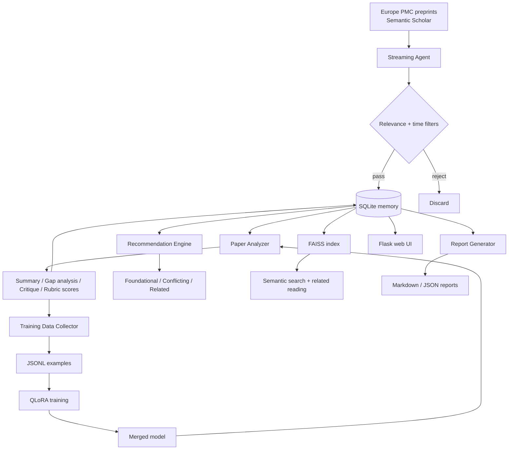

# Architecture Overview

The Journal Club pipeline ingests academic papers, analyzes them with an LLM,
ranks them by quality, recommends related reading, and fine-tunes a student
model on the collected analyses.

## Data flow

## Layers

### Ingestion (`core/streaming_agent.py`)
One background thread per configured topic. Each cycle:

1. Fetches candidates from cached Semantic Scholar search **and** Europe PMC
   preprint search (`SRC:PPR`, sorted by first publication date, paged when
   the time window is unlimited).
2. Applies the time-window filter and the domain-relevance gates
   (`BAD_TERMS` → `avoid_terms` → topic `target_classes`/`motif_terms` AND
   domain `relevance_terms`).
3. Deduplicates against the in-process cache **and** existing memory
   (normalized DOI/PMID/title), with a startup dedup pass.
4. Ingests into SQLite, computes summary + gap analysis + quality scores
   inline, and appends new documents to the local FAISS index.

### Memory (`core/literature_memory.py`)
SQLite database (WAL mode) with indexed `doi_norm`/`title_norm`/`topic_name`/
`domain` columns. See [memory.md](memory.md).

### Analysis (`core/paper_analyzer.py`)
Per paper: LLM summary, structured gap analysis (JSON validated with
Pydantic), critique, and quality scores against a rubric. Every LLM call
disables reasoning mode where supported and strips `<think>` traces;
deterministic rule-based fallbacks cover LLM failures. Results are cached
per-paper (`cache/analysis/`, schema `analysis.v2`).

LLM client priority (see [configuration.md](configuration.md)):

1. Fine-tuned merged model (when `JOURNAL_CLUB_USE_FINETUNED=1`)
2. External llama-server (`/v1/chat/completions`)
3. GGUF model via llama-cpp-python
4. Local HuggingFace base model
5. OpenAI fallback

### Recommendations (`core/recommendation_engine.py`)
- **Foundational**: papers with `citation_count >= 100` (or `>= 50` and
  `>= 5` years old).
- **Conflicting**: rule-based contradiction indicators, optionally verified
  by the LLM.
- **Related**: FAISS similarity search plus Semantic Scholar semantic search,
  deduplicated by DOI.

### Training (`core/train_lora.py`, `core/merge_lora.py`, `core/eval_model.py`)
Analysis outputs are converted into instruction-tuning examples, split at the
**paper level** (locked split), used to QLoRA-train a student model, merged,
optionally evaluated against the base model on held-out papers, versioned,
and activated. See [training.md](training.md).

### Web (`web/app.py`)
Flask app backed by a single shared memory instance, with a paginated topic
view, semantic search over FAISS, dynamic topic/domain configuration, and
markdown/JSON exports. See [web.md](web.md).

## Design principles

- **Deterministic fallbacks everywhere**: every LLM call has a rule-based
  fallback so the pipeline degrades gracefully without an LLM.
- **Deduplication at ingest**: normalized DOI/PMID/title keys, plus a
  merge-on-dedup pass that preserves analyses from duplicate copies.
- **Concurrency-safe storage**: SQLite WAL + per-instance locking; analysis
  runs in a thread pool with ordered results.
- **Training loop is closed**: the trained model takes priority in the LLM
  client chain, and activation can be gated on a held-out evaluation.
